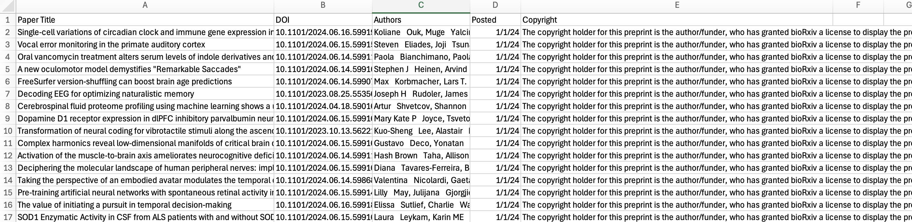

# Biorxiv
Code to download the publications by category from biorxiv


Figure: Crawled and extracted metadata about publications
## Dependencies
```python
pip install poetry
```
## Running
- Install required dependencies
    ```python
    poetry install
    ```
- Run the code, e.g., to download pdf: crawl_download_pdf.py and to download metadata: crawl_extract_metadata_csv.py
    ```python
    poetry run python crawl_extract_metadata_csv.py neuroscience metadata.csv 2 10
    ```
    
    The number 2 indicates to crawl 2 pages and number 10 indicates the 10 threadpool worker. For download publications, there's no need to specify the worker.
## License
MIT